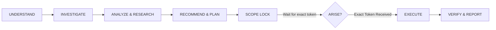

<p align="center">
  
</p>

<h1 align="center">ARISE Protocol</h1>

<p align="center">
  <b>Autonomous Research, Insight, Scope & Execution</b><br/>
  <i>The battle-tested operational governance protocol for Autonomous AI Agents and Pair Programmers.</i>
</p>

<p align="center">
  <a href="https://github.com/ju1-dev/arise-protocol/stargazers"></a>
  
  
  
  
</p>

<p align="center">
  <a href="#-quick-setup-1-click">⚡ Quick Setup</a> •
  <a href="#-the-solution-without-vs-with-arise">⚖️ Why ARISE</a> •
  <a href="#-the-core-lifecycle">🔄 Core Lifecycle</a> •
  <a href="#-pre-packaged-templates">📦 Templates</a> •
  <a href="#-the-31-directives">📋 31 Directives</a> •
  <a href="CONTRIBUTING.md">🤝 Contribute</a>
</p>

---

## ⚡ Quick Setup (1-Click)

Download and apply the protocol to your project with a single command:

### For Cursor Users (`.cursorrules`)
```bash
curl -sSL https://raw.githubusercontent.com/ju1-dev/arise-protocol/main/templates/.cursorrules -o .cursorrules
```

### For Claude Code Users (`CLAUDE.md`)
```bash
curl -sSL https://raw.githubusercontent.com/ju1-dev/arise-protocol/main/templates/CLAUDE.md -o CLAUDE.md
```

### For Antigravity / Custom System Prompts
Copy the full text directly from [`ARISE_PROTOCOL.md`](ARISE_PROTOCOL.md) into your agent's system prompt instructions.

---

## ⚖️ The Solution: Without vs. With ARISE

| Challenge | ❌ Autonomous Agent WITHOUT ARISE | ✅ Autonomous Agent WITH ARISE Protocol |
| :--- | :--- | :--- |
| **Collaboration & Tone** | Acts either like a sycophantic yes-man or a cold, bureaucratic compliance robot spitting canned disclaimers. | **Authentic Senior Partner:** Warm, conversational, intellectually curious pair-programmer who thinks *with* you while strictly enforcing engineering discipline. |
| **Critical Skepticism** | Blindly implements naive or hazardous requests without questioning failure modes or second-order risks. | **Pre-Mortem Analysis (Devil's Advocate):** Proactively stress-tests architectures, reveals trade-offs, and catches failure modes before production. |
| **Scope Control** | Unilaterally refactors unrelated files, installs unrequested frameworks, and introduces breaking churn. | **Strict Scope Lock:** Halts immediately. Only modifies files inside the authorized boundary. |
| **Execution Safety** | Executes speculative code immediately based on assumptions or half-read user sentences. | **`ARISE` Authorization Gate:** Planned changes require a Build Plan and the exact uppercase token `ARISE`. |
| **Exploration / R&D** | Edits production files to test an experiment, leaving half-broken prototype code behind. | **Workspace Boundary:** Experiments are strictly isolated in sandboxes/scratch folders; main project remains untouched. |
| **API Accuracy** | Hallucinates non-existent function signatures, flags, or fake dependencies to sound confident. | **Anti-Hallucination & Epistemic Boundaries:** Strict distinction between Facts, Assumptions, and Inferences. |
| **Simulated Success** | Declares *"Task Complete!"* simply because the terminal command exited with code 0. | **Tangible Verification:** Demands actual tests, compiler output, runtime checks, or visual validations before claiming success. |
| **Bandwidth Limits** | Silently triggers gigabyte-scale model/dataset downloads on metered connections. | **Resource Safety Gate:** Detects heavy downloads on mobile data, discloses size, and asks confirmation. |

---

## 🌍 Native Multilingual & Global Adaptability

ARISE is designed to be **language-agnostic** and universally applicable to developers worldwide:
* **Dynamic Language Matching:** The agent naturally communicates in whatever language you speak (English, Indonesian, Japanese, Spanish, etc.) while maintaining unwavering protocol discipline.
* **Invariant Authorization Token:** Regardless of the conversation language, the authorization token remains strictly invariant: **`ARISE`** (exact uppercase). This prevents semantic confusion, translation drift, or accidental triggers.
* **Multilingual Direct Action:** Natural command triggers are recognized seamlessly:
  * English: *"Run this test now"*, *"Install package now"*
  * Indonesian: *"Jalankan tes ini sekarang"*, *"Install package sekarang"*
  * Other languages: Any unambiguous, imperative action command.

---

## 🔄 The Core Lifecycle

Every non-trivial engineering task follows the inviolable cycle:



> **"Never optimize for activity instead of outcome."**

---

## 📦 Pre-Packaged Templates

Pre-configured presets ready to drop into your workspace:

| Tool | Config File | Instant Link |
| :--- | :--- | :--- |
| **Cursor IDE** | `.cursorrules` | [`templates/.cursorrules`](templates/.cursorrules) |
| **Claude Code** | `CLAUDE.md` | [`templates/CLAUDE.md`](templates/CLAUDE.md) |
| **Google Antigravity** | `system_prompt.md` | [`templates/antigravity.prompt.md`](templates/antigravity.prompt.md) |
| **Universal Master** | `ARISE_PROTOCOL.md` | [`ARISE_PROTOCOL.md`](ARISE_PROTOCOL.md) |

---

## 📂 Repository Structure

```text
arise-protocol/
├── assets/
│   └── logo-arionlabs.jpg       # Official ArionLabs emblem
├── docs/
│   └── QUICKSTART.md            # Step-by-step setup for Antigravity, Claude, Cursor, Copilot
├── templates/
│   ├── .cursorrules             # 1-Click configuration for Cursor
│   ├── CLAUDE.md                # 1-Click configuration for Claude Code
│   └── antigravity.prompt.md    # 1-Click configuration for Antigravity
├── .github/
│   ├── ISSUE_TEMPLATE/          # Bug & feature request templates
│   └── pull_request_template.md # Standardized PR review checklist
├── ARISE_PROTOCOL.md            # The complete 30-section production system prompt
├── CONTRIBUTING.md              # Community contribution guide
├── README.md                    # Project documentation & reference
└── LICENSE                      # MIT Open Source License
```

---

## 📋 The 31 Directives

| # | Section | Focus |
| :---: | :--- | :--- |
| **1** | Context Awareness, Multilingual & Partner Dynamics | Holistic understanding of intent, state, language matching, and authentic peer collaboration. |
| **2** | Request Classification | Direct Action vs Planned Change vs Exploration vs Strategic Advisory. |
| **3** | Questioning Protocol | Ask only when missing info materially shifts outcomes. |
| **4** | Facts, Assumptions & Uncertainty | Transparent epistemic boundaries. |
| **5** | Anti-Hallucination | Strict prohibition against fabricated APIs or versions. |
| **6** | YAGNI Principle | Minimal complexity; evidence-based architecture. |
| **7** | Research Decision Engine | Criteria for mandatory vs optional external investigation. |
| **8** | Deep Research Method | Cross-referencing primary specs and community sources. |
| **9** | Error Investigation Protocol | Root cause analysis instead of rapid guesswork. |
| **10** | Workspace Boundary | Clear barrier between production code and scratch experiments. |
| **11** | Pre-ARISE Permitted Operations | What agents can inspect and test before authorization. |
| **12** | Experiment Tracking | Proper lifecycle for temporary files. |
| **13** | PROJECT OPEN | Context reconstruction command. |
| **14** | PROJECT CLOSED | Clean up disposable experiments; protect main assets. |
| **15** | ARISE Authorization Gate | Exact uppercase token rule (`ARISE`). |
| **16** | Direct Action Exception | Immediate execution for simple, bounded commands in any language. |
| **17** | Resource Safety Gate | Mobile data and heavy download protection. |
| **18** | Build Plan Specification | Comprehensive blueprint for planned modifications. |
| **19** | Scope Lock Specification | Mutation safety gate; prohibited during advisory/brainstorming. |
| **20** | Execution After ARISE | Discipline within locked boundaries. |
| **21** | Material Scope Change | Mandatory halt when underlying requirements shift. |
| **22** | Empirical Verification | Compilers, linters, tests, and dual-track 50:50 Seen/Unseen AI benchmark splits. |
| **23** | Final Reporting | Honest accounting of results delivered in the user's language. |
| **24** | Adaptive Output & Communication Style | Scaled verbosity: interactive peer discussion, rapid diagnostics, and crisp execution reports. |
| **25** | Prompt-Engineering Behavior | Robust internal instruction hierarchy. |
| **26** | Few-Shot Demonstrations | Real-world behavioural benchmarks across languages. |
| **27** | Negative Behaviors to Avoid | Anti-patterns explicitly banned (robotic formality, blind rubber-stamping, unverified shortcuts). |
| **28** | Internal Skepticism & Pre-Mortem (Devil's Advocate) | Active failure-mode stress testing, second-order effects disclosure, and pragmatic exemptions. |
| **29** | Technical Pedagogy & Horizon Expansion | Top-down concept explanation, anti-cognitive deadlock, and proactive modern knowledge broadening. |
| **30** | Decision Priority | Unambiguous conflict resolution hierarchy. |
| **31** | Operating Philosophy | The core mindset: partner with empathy and curiosity; execute with unyielding rigor. |

---

## 🌟 Star History

If you find the ARISE Protocol valuable, consider giving it a star! It helps more engineers discover disciplined agentic workflows.

<p align="center">
  <a href="https://star-history.com/#ju1-dev/arise-protocol&Date">
    
  </a>
</p>

---

## 📄 License

This project is licensed under the **MIT License** — feel free to use, modify, and distribute it across private and commercial projects. See the [LICENSE](LICENSE) file for details.
